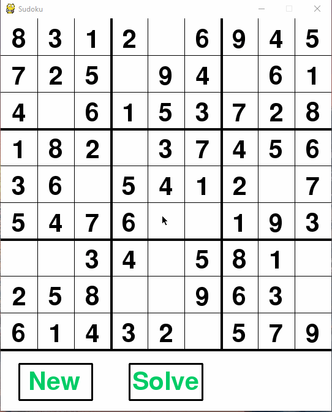

# Sudoku
Creates a Sudoku board using a backtracking algorithm  
Generator needs Solver and GUI needs Solver and Generator  
Written in Python 3.7  

We are using this fork to showcase pytest utility as an college assigment.

Use pytest --cov --cov-report=html --cov-config=.coveragerc --html=report.html
 no diretório raiz para testar o código e obter report de coverage e dos testes em si.

### Final Version

## Progress
### Initial Board
 
### Added cell selection and number input

## To Do List:
- [x] Generate a solvable Sudoku board
- [x] Create grid with filled in cells
- [x] Make the board interactable

---

## Sudoku_Solver :ballot_box_with_check:
Creates a completed 9x9 Sudoku board by using a backtracking algorithm to randomly "solve" an empty 9x9 board.

## Sudoku_Generator :ballot_box_with_check:
Uses Sudoku_Solver's output to randomly erase at least 17 cells to generate a Sudoku puzzle. Also prints out a more  
user-friendly version of the board as shown above.

## Sudoku_GUI :ballot_box_with_check:
Work in progress. Uses pygame and the above scripts to make an interactive Sudoku game.  

TO DO:
- [x] Draw puzzle onto the window
- [x] Mouse clicks over cells select and highlight them
- [x] Enable number input
- [x] Enable number input check
- [x] Add working check solution and new puzzle buttons

---

### Setup
Download and run in your favorite IDE
